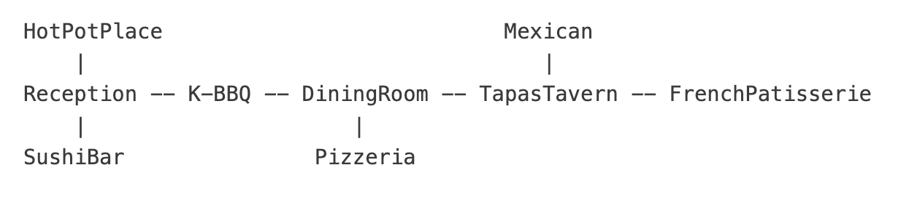

# This is a Command Line Based Game Developed in Haskell  
You're in a Culinary Quest! Bring the correct item into Dining Room!

## Video Demo
[](https://youtu.be/Qg27QflLd3U)


## Code Introduction
The Game Development utilizes comprehensive functional programming notions and skills such as custom data type, pattern matching, Do notation and IO Functions, Functors and Applicatives, Monads and States, Parser.  

## Game Instructions
To Launch the Game:
run below line in in terminal
```
stack exec functional-adventure-exe
```

In-game Control (player input should be in lowercase)
* look: print a description, items, exits for current room
* take: take itemA(, itemB, ...) to pick up items 
    use `,`  to separate multiple items if any 
    keep one space between the command and itemname
* drop: drop itemA(, itemB, ...) to drop items
    use `,`  to separate multiple items if any
    keep one space between the command and itemname
* eat:  eat itemA(, itemB, ...) to eat items
    use `,`  to separate multiple items if any
    keep one space between the command and itemname
* movement using north, south, east, west
* inventory: show player's current carrying items  
* exit / quit: Directly quit the game
* Use `and` between multiple commands to do a series of commands

## Game Features
* Slippery Items:
    - When a slippery item is picked up, it will automatically drop to its current located room after 2 successful player room movements;
    - Voluntary drop of slippery item won't reset the moves to slip;
    - Move counter will reset to 0 once item slips.
    - Slippery can be set in Item attribute, 
    current slippery items are `kimchi` and `avacado` 

* Eat Command:
    - Player can eat valid food in inventory
    - Eat command can only work when Player is carrying the tableware 
    - Eat poisoned food can result in direct failure of the game
    - Eat food can result in increase of strength (+10 weight limit per food)
    - Poisoned Food can be set in Item attribute, 
    current poisoned food are `paella` and `wasabi`

* Additional Take related behavior:
    - Take `cash` can result in direct failure of the game

## How to Win:
1. Take tableware at Dining Room 
    and eat 3+ dishes to increase weight limit to at least 130
2. Carry Sake (weight = 130) from Sushi Bar to Dining Room to win the game
3. Sake will slip on the way, so need to pick it up again 
4. Avoid eating `paella` or `wasabi`,
    which causes food poisoning and ends the game
5. Avoid taking `cash`, which causes arrest and ends the game

## Cheat Map:


## Implementation
* Item Module
    * Add new attributes for Item including:
        * slippery :: Bool
        * numberOfMoves :: Integer
        * consumed :: Bool
        * poisoned :: Bool
    * these attributes helps to track multiple slippery items, their moves once
    picked up, whether items was consumed, whether the food is poisoned

* GameState Module
    - Add checkSlippery function and helper functions:
    Add slippery item's moves or Drop the item based on its moves
    - Add a eatItem function:
    First do validation checks to make sure have target is edible,
    food is in inventory and player has tableware;
    Then do actual eat, update player record (inventory, weight)
    - Add functions to check tookCash, consumedPoisonedFood status

* Command Module
    - Add new Command Eat and new parser eatP in order to get `Eat [ItemName]`

* GameIO Module
    - When finish a valid move using performCommand (Move dir)
    call a slippery check and to update the slippery item 
    - Add new function to check whether tookCash or consumedPoisonedFood 
    - Call this check function in repl for each round of prompt
    - Add new functions to print failing message when arrested or food-poisoning

## Acknowledgments
Game structured and implemented with the help of Functional Programming syntax, codes and concepts by Drew Olson.   
